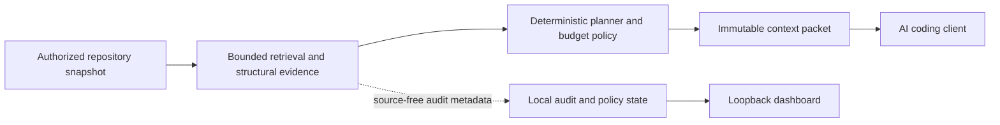
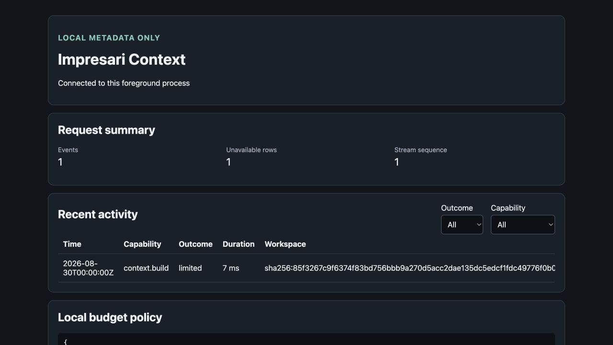

<p align="center">
  
</p>

<h1 align="center">Impresari Context</h1>

<p align="center"><strong>Verified, bounded repository context for AI coding tools.</strong></p>

<p align="center">
  <a href="https://github.com/tdloB/impresari-context/releases/tag/v0.1.0"></a>
  <a href="https://github.com/tdloB/impresari-context/actions/workflows/ci.yml"></a>
  <a href="LICENSE"></a>
  
  
</p>

<p align="center">
  <a href="#get-started">Get started</a> ·
  <a href="#how-it-works">How it works</a> ·
  <a href="#local-dashboard-and-budget-control">Dashboard</a> ·
  <a href="docs/reference/compatibility-matrix.md">Compatibility</a> ·
  <a href="#security-posture">Security</a> ·
  <a href="docs/product/revised-product-roadmap.md">Roadmap</a>
</p>

Impresari Context turns an exact local repository snapshot into bounded,
task-specific context packets with recoverable source evidence, explicit
omissions, integrity checks, and freshness validation.

It works beneath existing coding agents without taking control of execution,
permissions, approvals, or business policy. The result is a neutral context
layer that clients can inspect, verify, and integrate without replacing their
existing workflow.

| Bounded by design | Verifiable evidence | Local-first | Client-neutral |
| --- | --- | --- | --- |
| Explicit byte, item, depth, and time ceilings | Exact source spans, digests, omissions, and freshness | Repository content and audit state stay local | One core serves CLI, MCP, and recorded client integrations |

## Project status

| Scope | Current state |
| --- | --- |
| **Published release** | [`v0.1.0`](https://github.com/tdloB/impresari-context/releases/tag/v0.1.0) provides the portable CLI and local stdio MCP baseline for macOS ARM64, Linux x86-64, and Windows x86-64. Its exact claims are defined by the [`v0.1.0` conformance statement](CONFORMANCE.md). |
| **Current `main`** | Roadmap Phases 0–5 are complete for their accepted scopes. The branch adds deterministic planning, expanded bounded structural evidence, five version-bound first-class client integrations, quickstart, and the local dashboard with narrowing-only budget controls. |
| **Still gated** | Cross-platform production analyzer confinement, YARA-X repository scanning, Homebrew distribution, automatic updates, and the independent human security review are not published capabilities. Exact Linux candidates and synthetic YARA-X work do not authorize production scanning. |

Capabilities on `main` must not be attributed retroactively to the `v0.1.0`
binaries. See the [roadmap](docs/product/revised-product-roadmap.md) and
[compatibility matrix](docs/reference/compatibility-matrix.md) for current,
version-bound evidence and non-claims.

## Get started

### Install the published release

Download the archives and checksums from the
[`v0.1.0` release](https://github.com/tdloB/impresari-context/releases/tag/v0.1.0),
or use the checksum-verifying installer on macOS ARM64 or Linux x86-64. Download
and inspect the installer before running it:

```text
curl --fail --location --output impresari-install.sh \
  https://raw.githubusercontent.com/tdloB/impresari-context/main/scripts/install.sh
less impresari-install.sh
sh impresari-install.sh --version v0.1.0
```

The installer never selects `latest`, changes shell startup files, or
overwrites an installed binary. Other published platforms can use the release
archives directly.

### Build the current source

```text
git clone https://github.com/tdloB/impresari-context.git
cd impresari-context
cargo build --workspace --locked
./scripts/check.sh
```

The current source pins Rust 1.98.0 and declares Rust 1.96 as its minimum
supported Rust version.

### Preview a client connection

`quickstart` is available on `main` and is not present in `v0.1.0`:

```text
impresari-context quickstart \
  <codex|claude|cursor|copilot|vscode> \
  <absolute-workspace> \
  <absolute-separate-cache> \
  <absolute-client-config>
```

The command previews a machine-readable receipt by default. Review it, then
repeat the command with `--apply`. It does not trust, start, sign in to, enable,
approve, or invoke the client. See the
[local MCP connection guides](docs/reference/local-mcp-connection-guides.md)
for the exact configuration path and recorded scope for each client.

## How it works



Every request starts from an explicit workspace and a separate cache root.
Packets retain the evidence needed to recover exact current source and report
unsupported, partial, omitted, unresolved, stale, and truncated states rather
than silently broadening a claim.

## Core capabilities

| Capability | What it provides |
| --- | --- |
| **Evidence engine** | Capability-scoped reads, deterministic snapshots, bounded exact-path, filename, literal, and lexical retrieval, byte-verifiable evidence, immutable packets, validation, and no-overwrite export. |
| **Structural context** | Pinned parser workers and snapshot-bound structural graphs with explicit unresolved and truncated states. Syntax evidence never implies compiler, runtime, package-manager, or language-server semantics. |
| **Deterministic planning** | Profile-bound plans for orientation, implementation, bug investigation, change review, security review, test selection, and configuration changes, including coverage and omission reporting. |
| **Local MCP** | A single-client, process-local stdio transport with fixed launch authority. It adds no HTTP listener, network, model, source-write, approval, execution, or orchestration capability. |
| **Client integrations** | Managed connection, native guidance, guided delivery, and lifecycle-health evidence are admitted independently for exact client, version, OS, and configuration scopes. |

## Local dashboard and budget control

The post-`v0.1.0` dashboard is a foreground, loopback-only view of validated
audit metadata and exact-owned budget-policy state:

```text
impresari-context dashboard serve <audit-cache-root> <policy-state-root>
```

It shows request activity and narrowing-only budget policy without displaying
repository source or context packets. It does not open a browser, create a
daemon, make outbound requests, or raise a governing limit. Policy changes are
preview-first and bound to the exact current state.



_Source-free synthetic DBC-4 fixture. The dashboard displays local audit
metadata—not repository source or packet contents. See the
[native-browser admission record](docs/verification/dbc-4-native-browser-admission.md)._

## Client integrations

| Client | Classification on current `main` |
| --- | --- |
| Codex | First-class, with separately recorded L1–L4 evidence |
| Claude Code | First-class, with separately recorded L1–L4 evidence |
| Cursor | First-class, with separately recorded L1–L4 evidence |
| GitHub Copilot CLI | First-class, with separately recorded L1–L4 evidence |
| VS Code Copilot | First-class, with separately recorded L1–L4 evidence |
| Gemini CLI | Generic local MCP compatibility only |

“First-class” means a maintained versioned connection kit and client-specific
end-to-end evidence. It is not a claim about every version or platform. Consult
the [compatibility matrix](docs/reference/compatibility-matrix.md) for exact
versions, operating systems, lifecycle levels, expiry, and limitations.

## Structural language support

Current `main` has bounded syntax-derived structural evidence for:

- **Languages:** TypeScript, JavaScript, Python, Java, Kotlin, C#, Scala,
  Elixir, Clojure, Haskell, Go, Rust, C, C++, Ruby, PHP, and Swift.
- **Configuration formats:** strict JSON, JSONC, TOML, and deliberately bounded
  YAML.

File discovery and lexical evidence are broader than structural support. The
[compatibility matrix](docs/reference/compatibility-matrix.md) defines the
exact distinction and every format limitation.

## What it is—and what it is not

| Impresari Context is | Impresari Context is not |
| --- | --- |
| A bounded evidence and context-packet layer | An agent orchestrator or autonomous development runtime |
| A local CLI and stdio MCP process | A remote MCP service, daemon, or hosted source repository |
| A deterministic planner with explicit omissions | A guarantee of deterministic model behavior or tool selection |
| A narrowing-only local budget-control surface | A billing system or authority to increase organizational limits |
| A foundation for separately gated security analysis | A production malware scanner, quarantine VM, or universal sandbox today |

## Security posture

The trusted core is designed to fail closed on traversal, symlinks, stale
evidence, integrity failures, incompatible contracts, over-budget operations,
and authority-expanding input.

Current `main` also includes evidence-only hostile-repository inventory,
synthetic analyzer normalization, application-enforced synthetic worker
supervision, exact-host isolation candidates, and staged YARA-X compatibility
work. These do **not** establish that a repository is safe or malware-free and
do not authorize production scanner execution. macOS, Linux, and Windows
confinement are admitted independently; there is no blanket cross-platform
sandbox claim.

Read the [security threat model](docs/security/threat-model.md),
[Step 1 limitations](docs/security/hostile-repository-admission-limitations.md),
and [security policy](SECURITY.md) before relying on a security-sensitive
capability. Suspected vulnerabilities belong in the
[private security advisory channel](https://github.com/tdloB/impresari-context/security/advisories/new),
not a public issue.

## Measured impact

Reproducible comparisons against native client workflows are under development
in the independent evaluation harness. Published results will identify the
exact repository snapshot, client, model, configuration, baseline, run count,
and observed range.

Until those results exist, this README makes no token-savings, quality, or
productivity claim. The approved measurement contract is documented in the
[evaluation and benchmark PRD](docs/product/evaluation-prd.md).

## Documentation

| Area | Start here |
| --- | --- |
| **Using Impresari** | [CLI and MCP interfaces](docs/reference/interfaces.md) · [Local MCP connection guides](docs/reference/local-mcp-connection-guides.md) · [Compatibility matrix](docs/reference/compatibility-matrix.md) |
| **Architecture** | [Architecture](docs/architecture.md) · [System boundaries](docs/boundaries.md) · [Resource policy](docs/resource-policy.md) |
| **Product direction** | [Master PRD](docs/product/master-prd.md) · [Revised roadmap](docs/product/revised-product-roadmap.md) · [Client integration roadmap](docs/product/client-integration-roadmap.md) |
| **Security** | [Threat model](docs/security/threat-model.md) · [Residual risks](docs/security/residual-risks.md) · [Independent review guide](docs/security/independent-review-guide.md) |
| **Decisions and evidence** | [ADR index](docs/decisions/README.md) · [Verification records](docs/verification) · [Influences and provenance](docs/influences-and-provenance.md) |
| **Release assurance** | [`v0.1.0` conformance](CONFORMANCE.md) · [Release evidence](docs/verification/release-evidence.md) · [Changelog](CHANGELOG.md) |

## Contributing and support

Use [GitHub Issues](https://github.com/tdloB/impresari-context/issues) for bugs
and feature requests. Read [CONTRIBUTING.md](CONTRIBUTING.md) and the
[Code of Conduct](CODE_OF_CONDUCT.md) before proposing a change.

Impresari Context is licensed under [Apache License 2.0](LICENSE). Contributions
require Developer Certificate of Origin 1.1 sign-off as described in
[CONTRIBUTING.md](CONTRIBUTING.md).
